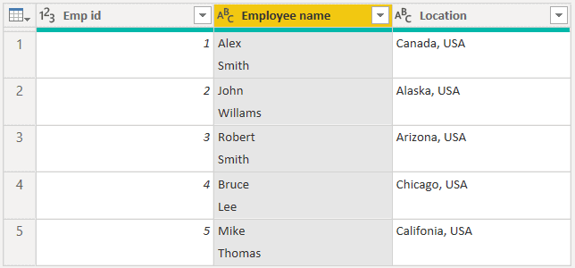
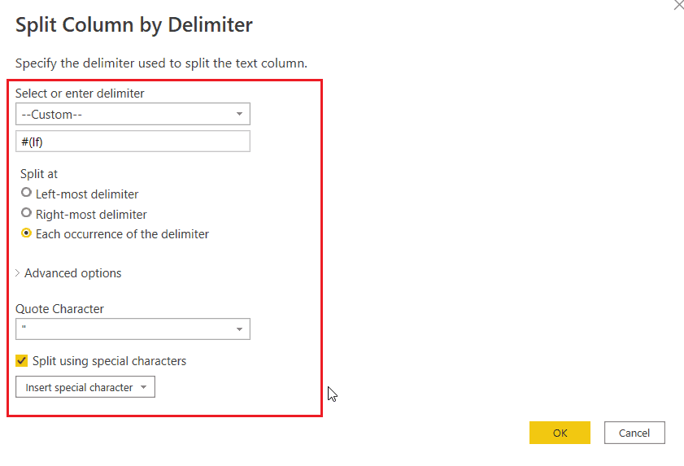
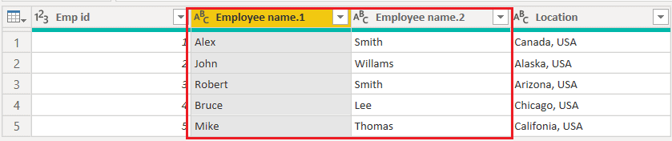

Power Bi Data Cleaning:
Power BI split column by new line (https://www.spguides.com/split-columns-in-power-bi/#:~:text=In%20Power%20Query%20Editor%2C%20select%20the%20Name%20column%20%2D%3E%20click,Click%20on%20Ok.)
Here we will see how to split column by new line or line break using Power Query in Power BI.

For example, we will use the below table and split the Employee name column using a split column by a new line in Power query Editor.

To split the column by a new line in Power Query Editor, follow the below steps

In Power Query Editor, select the Employee name column, and then click on the Split column option -> select the By Delimiter option.
Then, Split Column By Delimiter window will open, select the Custom option for the delimiter, select Each occurrence of delimiter under Split at, and then tick the Split using Special character option, then insert special character as Line Feed. Click on Ok.

Once you click on ok, the column gets splits by a new line, then rename the column.

**********
https://learn.microsoft.com/en-us/powerquery-m/m-spec-lexical-structure

new-line-character:
      Carriage return character (U+000D)
      Line feed character (U+000A)
      Next line character (U+0085)
      Line separator character (U+2028)
      Paragraph separator character (U+2029)

For compatibility with source code editing tools that add end-of-file markers, and to enable a document to be viewed as a sequence of properly terminated lines, the following transformations are applied, in order, to an M document:

If the last character of the document is a Control-Z character (U+001A), this character is deleted.

A carriage-return character (U+000D) is added to the end of the document if that document is non-empty and if the last character of the document is not a carriage return (U+000D), a line feed (U+000A), a line separator (U+2028), or a paragraph separator (U+2029).