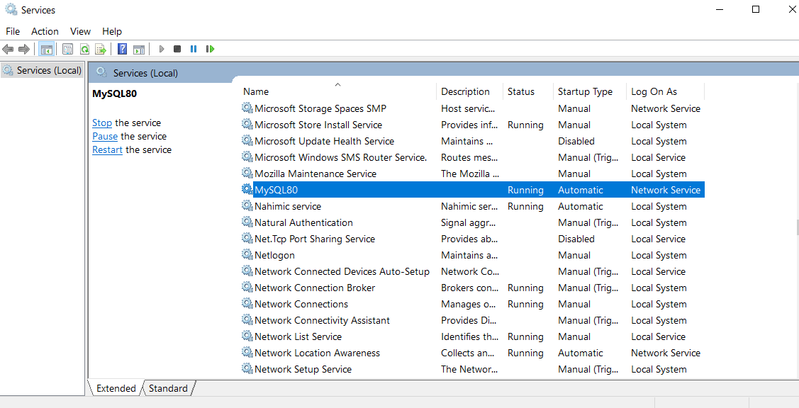
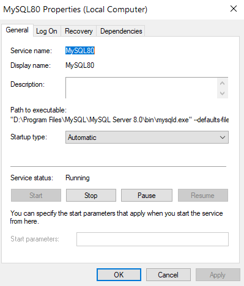

MySQL

127.0.0.1:3306
farmers_market

If your MySQL database is hosted on "localhost" or "127.0.0.1" with port 3306, it means that the MySQL server is running on the same machine (the local machine) where you are trying to connect to it. Here's what these terms mean:

1. localhost: When you specify "localhost" as the host for your MySQL connection, it tells MySQL to connect to the MySQL server running on the same machine where you're making the connection. This is often used when you're working on a local development environment or when your web server and MySQL server are on the same machine.
2. 127.0.0.1: This is the loopback IP address, which also points to the local machine. Like "localhost," specifying "127.0.0.1" as the host for your MySQL connection means you're connecting to the MySQL server on the same machine.
3. Port 3306: Port 3306 is the default port for MySQL. It's the port that MySQL server listens on for incoming connections.

So, when you use "localhost" or "127.0.0.1" as the host along with port 3306, you are connecting to a MySQL server running locally on the same machine. This is a common configuration for development and testing environments.

******
Troubleshooting:

To check the status of the MySQL service on Windows, you can use the following command in the terminal:services.msc
It will open the following window: 

The image above shows that the MySQL service is running. The Service status is shown as "Running" and the Start button is disabled, which indicates that the service is already running.